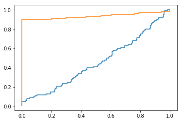

# Evaluation metrics


Adapted from [this blog post](https://www.kdnuggets.com/2018/06/right-metric-evaluating-machine-learning-models-2.html).

### References
- [Precision and Recall overview](https://en.wikipedia.org/wiki/Precision_and_recall)
- [Precision and Recall with imbalanced datasets.](https://classeval.wordpress.com/simulation-analysis/roc-and-precision-recall-with-imbalanced-datasets/)
- [Systematic analysis of performance measures for classification tasks](https://www.sciencedirect.com/science/article/pii/S0306457309000259)
- [Multi-class vs. multi-label classification](https://stats.stackexchange.com/questions/11859/what-is-the-difference-between-multiclass-and-multilabel-problem)
- [Micro-average vs. macro-average](https://datascience.stackexchange.com/questions/15989/micro-average-vs-macro-average-performance-in-a-multiclass-classification-settin/16001)

## Set-up


```python
# Import required dependencies:

from __future__ import division

import math
import matplotlib.pyplot as plt
import numpy as np
import random
import sklearn

from collections import Counter

from math import log

from sklearn import metrics

from sklearn.metrics import (
    f1_score,
    log_loss,
    roc_auc_score
)


# Function to count the true positives, true negatives,
# false positives, and false negatives given an array of
# gold standard (gold truth) labels (Y) and a correlative
# array of system predictions (_Y).
#
# Optional parameter 'threshold' can be specified to
# modulate the definition of truth by requiring confidence/
# probabilities over a set threshold.

def count_y(Y, _Y, threshold=0.5):
    tp, tn, fp, fn = 0, 0, 0, 0
    for i, y in enumerate(_Y):
        gold = Y[i]
        if gold:
            if y >= threshold:
                tp += 1
            else:
                fn += 1
        else:
            if y >= threshold:
                fp += 1
            else:
                tn += 1
    return tp, tn, fp, fn


# Function to call a metric on two arrays, one containing
# the ground truth (aka gold standard) and another containing
# a given set of model predictions.
def measure(Y, _Y, metric):
    tp, tn, fp, fn = count_y(Y, _Y)
    return metric(tp, tn, fp, fn)


# Wrapper over function 'measure' above;
# runs it over all the toy datasets and
# prints the results.
def experiment(metric):
    for name, true, guess1, guess2 in DATASETS:
        measurement1 = measure(true, guess1, metric)
        measurement2 = measure(true, guess2, metric)
        print 'dataset=%s\ta=%.2f b=%.2f' % (name, measurement1, measurement2)
```


## Toy datasets

### Case 1 (c1)

Let's assume we have an array of gold labels/ground truth labels, Y, and predictions from two models, Y1 and Y2, as shown below:


```python
c1_Y = [0 for x in range(8)] + [1 for x in range(8)]
c1_pred_Y1 = [0.1, 0.1, 0.1, 0.1, 0.1, 0.1, 0.6, 0.6, 0.5, 0.5, 0.9, 0.9, 0.9, 0.9, 0.9, 0.9]
c1_pred_Y2 = [0.6, 0.6, 0.6, 0.6, 0.6, 0.6, 0.6, 0.6, 0.7, 0.7, 0.7, 0.7, 0.8, 0.8, 0.8, 0.8]

print c1_Y
print c1_pred_Y1
print c1_pred_Y2
```

    [0, 0, 0, 0, 0, 0, 0, 0, 1, 1, 1, 1, 1, 1, 1, 1]
    [0.1, 0.1, 0.1, 0.1, 0.1, 0.1, 0.6, 0.6, 0.5, 0.5, 0.9, 0.9, 0.9, 0.9, 0.9, 0.9]
    [0.6, 0.6, 0.6, 0.6, 0.6, 0.6, 0.6, 0.6, 0.7, 0.7, 0.7, 0.7, 0.8, 0.8, 0.8, 0.8]


#### Key points to notice
- Model Y1 is doing a better job in predicting the absolute probabilities, whereas
- model Y2 is working best in ranking observations according to their true labels.

### Case 2 (c2)

Let's further assume we also have the following dataset, which will be useful for assessing differences in the classification of imbalanced classes (the class with few observations, which is label 1 in this dataset).


```python
c2_Y = [0 for x in range(13)] + [1 for x in range(3)]
c2_pred_Y1 = [0.1 for x in range(14)] + [0.9, 0.9]
c2_pred_Y2 = [0.1 for x in range(12)] + [0.9 for x in range(4)]

print c2_Y
print c2_pred_Y1
print c2_pred_Y2
```

    [0, 0, 0, 0, 0, 0, 0, 0, 0, 0, 0, 0, 0, 1, 1, 1]
    [0.1, 0.1, 0.1, 0.1, 0.1, 0.1, 0.1, 0.1, 0.1, 0.1, 0.1, 0.1, 0.1, 0.1, 0.9, 0.9]
    [0.1, 0.1, 0.1, 0.1, 0.1, 0.1, 0.1, 0.1, 0.1, 0.1, 0.1, 0.1, 0.9, 0.9, 0.9, 0.9]


#### Key points to notice
- The only difference in the two models is their prediction for observation 13 and 14.
  - Model Y1 is doing a better job in classifying observation 13 (label 0) whereas
  - Model Y2 is doing better in classifying observation 14 (label 1).

That is,
- the model giving predictions Y1 is making a mistake 1) in favor of the majority class and 2) in favor of the negative class, i.e., implies one fewer positive (that is, a metric focusing on positives will tend to assign a lower score), whereas
- the model returning predictions Y2 is making a mistake 1) in favor of the minority class and 2) in favor of the positive class, i.e., implies one fewer negative (that is, any metrics focusing on positives will tend to assign it a higher score).

> In problems like fraud detection/spam mail detection, where positive labels are few, we would like our model to predict positive classes correctly and hence we will sometime prefer those model who are able to classify these positive labels.

### Case 3 (c3)

Finally, let's assume we also have one large, clearly imbalanced gold dataset, consisting of only 100 positive examples and 900 negative examples. The predictions of the two models being compared differ only for a handful of cases:
- the first model predicted only 5 out of 100 positives (with 95, or almost 10% false negatives), whereas
- the second model predicted 90 out of 100 (with 10, 1% false negatives).


```python
c3_Y = np.concatenate((np.ones(100), np.zeros(900)))

a = np.random.uniform(0.5,1, 5)
b = np.random.uniform(0,0.5, 995)
c3_pred_Y1 = np.concatenate((a,b))

a = np.random.uniform(0.5,1, 90)
b = np.random.uniform(0,0.5, 910)
c3_pred_Y2 = np.concatenate((a,b))
```


```python
DATASETS = [
    ('c1', c1_Y, c1_pred_Y1, c1_pred_Y2),
    ('c2', c2_Y, c2_pred_Y1, c2_pred_Y2),
    ('c3', c3_Y, c3_pred_Y1, c3_pred_Y2)
]
```

## Core metrics

### Precision

Ratio of true positives over positives.

TP / (TP + FP)


```python
def precision(tp, tn, fp, fn):
    if not tp:
        return 0.0
    return tp / (tp + fp)

experiment(precision)
```

    dataset=c1	a=0.80 b=0.50
    dataset=c2	a=1.00 b=0.75
    dataset=c3	a=1.00 b=1.00


#### Key insights
If we assume a classification probability threshold of 0.5 (such that any prediction below that number is considered negative, or a prediction of class 0, and any prediction above it is considered positive, or a prediction of class 1), then
- over dataset `c1`, Precision is 80% for the first model and 50% for the second because the latter incorrectly predicted as positives (>0.5) half of the datapoints known to be negatives (albeit negatives with a high probability), whereas the former model made only two incorrect generalizations (2/10 = 20% generalization error, i.e., 100 - **20** = 80% Precision).
- over dataset `c2`, Precision is 100% for the first model and 75% for the second because, out of 3 positive instances, the former made no incorrect generalizations (despite missing one true positive), whereas the latter did (1 out of 4 predictions i.e., 25% error, or 75% success ~ Precision).
- over dataset `c3`, Precision is 100% for both models because they didn't label as positive any negative instances (the only errors are missed positives, i.e., false negatives; there are no false positives).

### Recall

Ratio of true positives over positives (true = all known items of a class).

Also known as: _True Positive Rate (TPR)_, _Hit Rate_, _Sensitivity_.

TP / (TP + FN)


```python
def recall(tp, tn, fp, fn):
    if not tp:
        return 0.0
    return tp / (tp + fn)

experiment(recall)
```

    dataset=c1	a=1.00 b=1.00
    dataset=c2	a=0.67 b=1.00
    dataset=c3	a=0.05 b=0.90


#### Key insights
With the same assumptions as for Precision (a classification probability threshold of 0.5),
- over dataset `c1`, Recall is 100% for both models because both found all positives (they didn't miss any relevant matches, regardless of any generalization mistakes they may have made).
- over dataset `c2`, Recall is 67% for the first model and 100% for the second because the former missed 1 out of 3 positive instances, whereas the latter didn't miss any (so, it scores 100% and it does not matter whether it also made any generalization (Precision) mistakes).
- over dataset `c3`, Recall is 5% for the first model and 90% for the second; the reasons are similar as those for `c2`.
- **General.** A given Precision does not necessarily imply a specific Recall.
- **General.** Ideally, both figures should approach 100%.

### Specificity

_True Negative Rate (TNR)_

Ratio of true negatives over negatives\*.

\*(Either true negatives or false positives that should have actually been classified as negatives.)

TN / ( TN + FP )

TNR is the inverse of the Recall, with positives and negatives swapped in the formula.

It quantifies how well the system performs with negatives (by comparing the number of them it got correctly as such, with the total number of them, i.e., including the negatives it didn't get right).

~~TNR counts the model's predictions of the negative class and compares them to the total number of negative instances. The ideal system would mark all those instances as negative (and would hence get 100% TNR). However, if it didn't, and it incorretly made a non-negative prediction for any number of those instances, then that number is added to whatever number of true negatives it was able to find (if any) and ratio of the latter over their sum is calculated.~~


```python
def specificity(tp, tn, fp, fn):
    return tn / (tn + fp)

experiment(specificity)
```

    dataset=c1	a=0.75 b=0.00
    dataset=c2	a=1.00 b=0.92
    dataset=c3	a=1.00 b=1.00


### Accuracy

Ratio of true over true and false.

(TP + TN) / (TP + TN + FP + FN)


```python
def accuracy(tp, tn, fp, fn):
    return (tp + tn) / (tp + tn + fp + fn)

experiment(accuracy)
```

    dataset=c1	a=0.88 b=0.50
    dataset=c2	a=0.94 b=0.94
    dataset=c3	a=0.91 b=0.99


### F-measure

Harmonic mean of Precision and Recall.

F1 = 2 x Precision \* Recall / ( Precision + Recall )


```python
def f1(tp, tn, fp, fn):
    p = precision(tp, tn, fp, fn)
    r = recall(tp, tn, fp, fn)
    if not p + r:
        return 0.0
    return 2 * p * r / (p + r)

experiment(f1)
```

    dataset=c1	a=0.89 b=0.67
    dataset=c2	a=0.80 b=0.86
    dataset=c3	a=0.10 b=0.95


## Error metrics

### False Positive Rate (FPR, anti-Precision)

_Type I Error_, _False Alarm Rate_, _Fall-out_

Ratio of false positives over all negatives.

FP / ( TN + FP )

Equal to 1 - Specificity


```python
def false_alarms(tp, tn, fp, fn):
#     return 1 - (tn / (tn + fp))
    return 1 - specificity(tp, tn, fp, fn)

experiment(false_alarms)
```

    dataset=c1	a=0.25 b=1.00
    dataset=c2	a=0.00 b=0.08
    dataset=c3	a=0.00 b=0.00


### False Negative Rate (FNR, anti-Recall)

_Type II Error_, _Miss rate_

Ratio of false negatives over all positives.

FN / ( FN + TP )


```python
def miss_rate(tp, tn, fp, fn):
#     return fn / (fn + tp)
    return 1 - recall(tp, tn, fp, fn)

experiment(miss_rate)
```

    dataset=c1	a=0.00 b=0.00
    dataset=c2	a=0.33 b=0.00
    dataset=c3	a=0.95 b=0.10


### Error Rate (ER, ~anti-Accuracy)

1 – Accuracy


```python
def error_rate(tp, tn, fp, fn):
    return 1 - accuracy(tp, tn, fp, fn)

experiment(error_rate)
```

    dataset=c1	a=0.12 b=0.50
    dataset=c2	a=0.06 b=0.06
    dataset=c3	a=0.09 b=0.01


## ROC (Receiver Operating Characteristic) and AUC (Area Under the Curve)

[Source](https://www.kdnuggets.com/2018/06/right-metric-evaluating-machine-learning-models-2.html)

### ROC (Receiver Operating Characteristic)
Plot of FPR (False Positive Rate, **False Alarms**) versus TPR (True Positive Rate, **Recall**).


### AUC (Area Under the Curve)
The probabilistic interpretation of ROC-AUC score is that if you randomly choose a positive case and a negative case, the probability that the positive case outranks the negative case according to the classifier is given by the AUC. Here, rank is determined according to order by predicted values.

Mathematically, it is calculated by area under curve of sensitivity (TPR) vs. FPR (1 - Specificity), typically across various threshold settings for purposes of comparison.

Ideally, we would like to have high sensitivity and high specificity, but in real-world scenarios there is always a tradeoff between sensitivity ad specificity.

The value can range from 0 to 1. However AUC score of a random classifier for balanced data is 0.5.

c3


```python
print 'F1 _Y1', metrics.f1_score(c3_Y, c3_pred_Y1>=0.5)
print 'F1 _Y2', metrics.f1_score(c3_Y, c3_pred_Y2>=0.5)
print '---'

# fpr = array: float, false positive rate, i.e., False alarms
# tpr = array: float, true positive rate, i.e., Recall
# threshold = array: float
#
# fpr, tpr, and threshold are all correlative; i.e., fpr and tpr given a certain threshold.
fpr1, tpr1, threshold1 = metrics.roc_curve(c3_Y, c3_pred_Y1)
fpr2, tpr2, threshold2 = metrics.roc_curve(c3_Y, c3_pred_Y2)

plt.plot(fpr1, tpr1)
plt.plot(fpr2, tpr2)

auc1 = np.trapz(tpr1, fpr1)
auc2 = np.trapz(tpr2, fpr2)

print
print 'AUC _Y1', auc1
print 'AUC _Y2', auc2
print '---'
print 'sklearn.metrics ROC-AUC _Y1', metrics.roc_auc_score(c3_Y, c3_pred_Y1)
print 'sklearn.metrics ROC-AUC _Y2', metrics.roc_auc_score(c3_Y, c3_pred_Y2)
```

    F1 _Y1 0.09523809523809523
    F1 _Y2 0.9473684210526316
    ---
    
    AUC _Y1 0.45591111111111116
    AUC _Y2 0.9343888888888889
    ---
    sklearn.metrics ROC-AUC _Y1 0.45591111111111116
    sklearn.metrics ROC-AUC _Y2 0.9343888888888889





## Kappa statistics

## Confusion matrix

## Log loss

Vid. "/Users/jordi/Laboratorio/Python/samples/Log+loss.html".


```python
def logloss(Y, _Y):
    return log_loss(Y, _Y)
```

### Multi-class log-loss
N = number of test instances

M = number of classes

Y\[i,j\] = test instance i's label for class j, i.e., ground truth/gold standard. 1 if the intance is labeled for that class, 0 otherwise.

p\[i, j\] = probability of the system's prediction for test instance Y\[i, j\]

logloss = -(1 / N) SUM\[i=1\]\{N\} ( SUM\[j=1\]\{M\} Y\[i, j\] * log(p\[i, j\]) )


```python
def multi_logloss(Y, _Y):
#     m = len(_Y[0])
    n = len(Y)
    norm = -(1 / n)
    
    loss = 0.0
    for i, row in enumerate(Y):
        for j, prob in enumerate(_Y[i]):
            _loss = (row[j] * log(prob))
            loss += _loss
    return norm * loss


print 'sklearn', log_loss(
    [1, 0, 0, 1],
    [[.1, .9], [.9, .1], [.8, .2], [.35, .65]]
)
print 'jordi', multi_logloss(
    [[0, 1], [1, 0], [1, 0], [0, 1]],
    [[.1, .9], [.9, .1], [.8, .2], [.35, .65]]
)

print '---'

print 'sklearn', log_loss(
    [0, 1, 0, 1, 0, 1, 0, 1, 0, 1],
    [[0.5, 0.5], [0.5, 0.5], [0.5, 0.5], [0.5, 0.5], [0.5, 0.5], [0.5, 0.5], [0.5, 0.5], [0.5, 0.5], [0.5, 0.5], [0.5, 0.5]]
)
print 'jordi', multi_logloss(
    [[1, 0], [0, 1], [1, 0], [0, 1], [1, 0], [0, 1],[1, 0], [0, 1], [1, 0], [0, 1]],
    [[0.5, 0.5], [0.5, 0.5], [0.5, 0.5], [0.5, 0.5], [0.5, 0.5], [0.5, 0.5], [0.5, 0.5], [0.5, 0.5], [0.5, 0.5], [0.5, 0.5]]
)
```

    sklearn 0.21616187468057912
    jordi 0.216161874681
    ---
    sklearn 0.6931471805599453
    jordi 0.69314718056


# Examples

[Source](https://www.kdnuggets.com/2018/06/right-metric-evaluating-machine-learning-models-2.html)

## Case 1: Comparison of Log-loss with ROC & F1

c1


```python
print
for name, metric in [
    ('f1', f1), ('F1_score', f1_score), ('accuracy', accuracy),
    ('precision', precision), ('recall', recall),
    ('false_alarms', false_alarms), ('miss_rate', miss_rate),
    ('log_loss', log_loss),
    ('roc_auc_score', roc_auc_score),
]:
    for _name, model in [('Y1', c1_pred_Y1), ('Y2', c1_pred_Y2)]:
        
        # this if block is needed because sklearn's F1 score function cannot mix
        # scalars and integers; the if checks if the iteration is for that
        # function; if so, it rounds the input to convert it to 0s and 1s:
        if name != 'F1_score':
            if name in 'f1 accuracy precision recall false_alarms miss_rate'.split():
                #tp, tn, fp, fn = count_y(c1_Y, model)
                tp, tn, fp, fn = count_y(c1_Y, [1 if x >= 0.7 else 0 for x in model])   # use this line instead of the preceding one for 1.0 Accuracy for Y2
                print name, _name, metric(tp, tn, fp, fn)
            else:
                print name, _name, metric(c1_Y, model)
        else:
            print name, _name, metric(c1_Y, [round(x) for x in model])
    print '---'
```

    
    f1 Y1 0.857142857143
    f1 Y2 1.0
    ---
    F1_score Y1 0.888888888888889
    F1_score Y2 0.6666666666666666
    ---
    accuracy Y1 0.875
    accuracy Y2 1.0
    ---
    precision Y1 1.0
    precision Y2 1.0
    ---
    recall Y1 0.75
    recall Y2 1.0
    ---
    false_alarms Y1 0.0
    false_alarms Y2 0.0
    ---
    miss_rate Y1 0.25
    miss_rate Y2 0.0
    ---
    log_loss Y1 0.2802001257976322
    log_loss Y2 0.6030999897503131
    ---
    roc_auc_score Y1 0.9375
    roc_auc_score Y2 1.0
    ---


If you consider log-loss, Model Y2 is worst giving a high value of log-loss because the absolute probabilities have big difference from actual labels.

But this is in complete disagreement with F1 and AUC score, according to which Model Y2 has 100% accuracy.

F1 score varies, and prefers model Y1 over model Y2 for the default threshold of 0.5.

### Key insights
- If you care for **absolute probabilistic difference**, go with **log-loss**.
- If you care only for the **final class prediction** and you don’t want to tune threshold, go with **AUC** score.
- **F1 score is sensitive to threshold** and you would want to tune it first before comparing the models.

## Case 2: How each of them deals with class imbalance?

c2

The goal is to see which model actually captures the difference in classifying the imbalanced class better (the class with few observations, which is label 1 in the example below).


```python
print
for name, metric in [
    ('f1', f1), ('F1_score', f1_score), ('accuracy', accuracy),
    ('precision', precision), ('recall', recall),
    ('false_alarms', false_alarms), ('miss_rate', miss_rate),
    ('log_loss', log_loss),
    ('roc_auc_score', roc_auc_score),
]:
    for _name, model in [('Y1', c2_pred_Y1), ('Y2', c2_pred_Y2)]:
        
        # this if block is needed because sklearn's F1 score function cannot mix
        # scalars and integers; the if checks if the iteration is for that
        # function; if so, it rounds the input to convert it to 0s and 1s:
        if name != 'F1_score':
            if name in 'f1 accuracy precision recall false_alarms miss_rate'.split():
                #tp, tn, fp, fn = count_y(c1_Y, model)
                tp, tn, fp, fn = count_y(c2_Y, [1 if x >= 0.7 else 0 for x in model])   # use this line instead of the preceding one for 1.0 Accuracy for Y2
                print name, _name, metric(tp, tn, fp, fn)
            else:
                print name, _name, metric(c2_Y, model)
        else:
            print name, _name, metric(c2_Y, [round(x) for x in model])
    print '---'
```

    
    f1 Y1 0.8
    f1 Y2 0.857142857143
    ---
    F1_score Y1 0.8
    F1_score Y2 0.8571428571428571
    ---
    accuracy Y1 0.9375
    accuracy Y2 0.9375
    ---
    precision Y1 1.0
    precision Y2 0.75
    ---
    recall Y1 0.666666666667
    recall Y2 1.0
    ---
    false_alarms Y1 0.0
    false_alarms Y2 0.0769230769231
    ---
    miss_rate Y1 0.333333333333
    miss_rate Y2 0.0
    ---
    log_loss Y1 0.24268705174134
    log_loss Y2 0.24268705174134
    ---
    roc_auc_score Y1 0.8333333333333333
    roc_auc_score Y2 0.9615384615384616
    ---


Clearly log-loss is failing in this case because according to log-loss both the models are performing equally. This is because log-loss function is symmetric and does not differentiate between classes.

**JORDI**: the same holds for Accuracy.

**JORDI**: not sure the result should change necessarily, both models are making the same number of mistakes and erring in favor of one class or the other may not be necessarily better.

**JORDI**: but only model 2 got all the positives; if we care about Recall, that is probably the metric we want to maximize. Both ROC-AUC and F1 are sensitive to that difference.

### Key insights
Both **F1-score and ROC-AUC** can be used to measure performance over **imbalanced data**.

ROC-AUC does not care whether the class is positive or negative, only whether it is smaller than the other class and whether the data is therefore imbalanced.

When you have a small positive class, then F1 score makes more sense. ROC-AUC treats imbalanced classes equally; **JORDI**: if the positive class is much smaller than the negative class, we could get high scores despite a extremely low number of positives. F1 score does not have the problem and does not hide low recall. For illustration, given a dataset of size 10K observations,
- a model predicting 5 positives out of 100 true positives (1/20) would score a
  - 0.095 F1-score and
  - 0.5 ROC-AUC
- another model predicting 90 positives out of 100 true positives (18/20) would score
  - 0.95 F1-score and
  - 0.93 ROC-AUC.

The ROC-AUC score for a model performing 18 times better than another would only be 2 times higher, whereas the F1-score would be 10 higher. In this case, F1-score gives a better idea of the actual difference in performance between the two models.

# Multi-class evaluation

## Definition
A multi-class classification task is a classification task with more than two classes such that the input is to be classified into one, and only one of the classes. Example: classify a set of images of fruits into any one of apples, bananas, and oranges.

## Metrics
The most commonly used metrics for multi-classes are
- F1 score
- Average Accuracy
- Log-loss
There is yet no well-developed ROC-AUC score for multi-class.

## Calculation
True positives, true negatives, false positives and false negatives are counted separately for every class in the task and then micro- or macro-averaged.
- In __micro-average__ method, you sum up the individual true positives, false positives, and false negatives of the system for different sets and then apply them to get the statistics.
- In __macro-average__, you take the average of the Precision and Recall of the system on different sets.

> Micro-average is preferable if there is a class imbalance problem.

__JORDI: no:__ It depends. In the micro-average (average over prediction instances), performance for the majority classes will hide the performance for the minority classes. It will be higher, but biased towards the majority class. In the macro-average (average over prediction results per class), given the score normalization, poor performance for a minority class is not "minor" like that class at the instance level, but actually becomes of the same order/scale (due to the normalization of the score into a metric) as the score for majority classes.

__JORDI:__ As a result, low performance in that class will count **more strongly, and more significantly, against** the final performance number, hence will no longer be masked and, although it will mean our system performs worse on paper, it will also give us a more accurate picture of its true performance over all classes.


### Calculation how-to

[Source](https://github.com/scikit-learn/scikit-learn/issues/83)

> In the literature, the macro-average and micro-average are usually used but as far as I understand the current code does neither one. The macro is the unweighted average of the precision/recall taken separately for each class. Therefore it is an average over classes. The micro average on the contrary is an average over instances: therefore classes which have many instances are given more importance. However, AFAIK it's not the same as taking the weighted average as currently done in the code.

```
# JORDI: we assume that both true_pos and false_pos are arrays with the results
# over each dataset or system configuration, such that we can perform 
# element-wise operations on their values.
micro_avg_precision = true_pos.sum() / (true_pos.sum() + false_pos.sum())
micro_avg_recall = true_pos.sum() / (true_pos.sum() + false_neg.sum())
macro_avg_precision = np.mean(true_pos / (true_pos + false_pos))
macro_avg_recall = np.mean(true_pos / (true_pos + false_neg))
```


